# Benchmark of `typescript-json`
> CPU: Neoverse-N1
> Memory: 5,761 MB
> NodeJS version: v16.17.0

## assert
 Components | typescript-json | typescript-is 
------------|-----------------|---------------
object (hierarchical) | 12917.27115716753 | 12749.690210656754
object (recursive) | 16419.82142857143 | 13230.864855265494
object (union) | 2885.8618233618236 | 1297.593390804598
array (recursive) | 851.2149532710281 | 946.944749359678
array (union) | 1817.8772919605078 | 135.3758460990381
ultimate union | 2579.755736491488 | 20.65884980457845

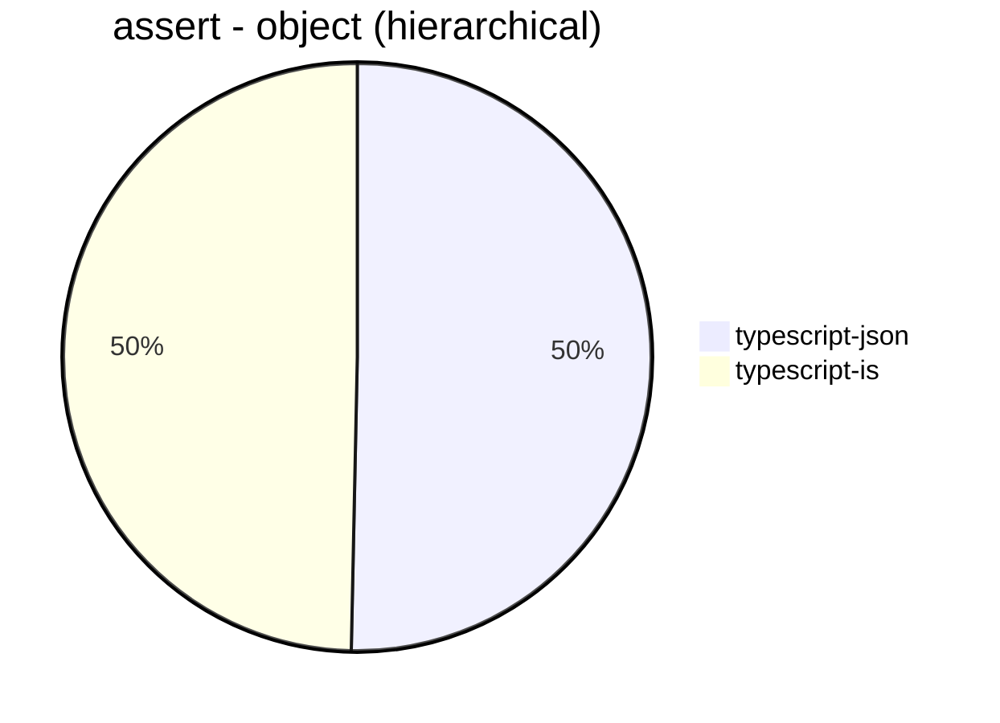
```mermaid
pie title assert - object (hierarchical)
  "typescript-json": 12917.27115716753
  "typescript-is": 12749.690210656754
```

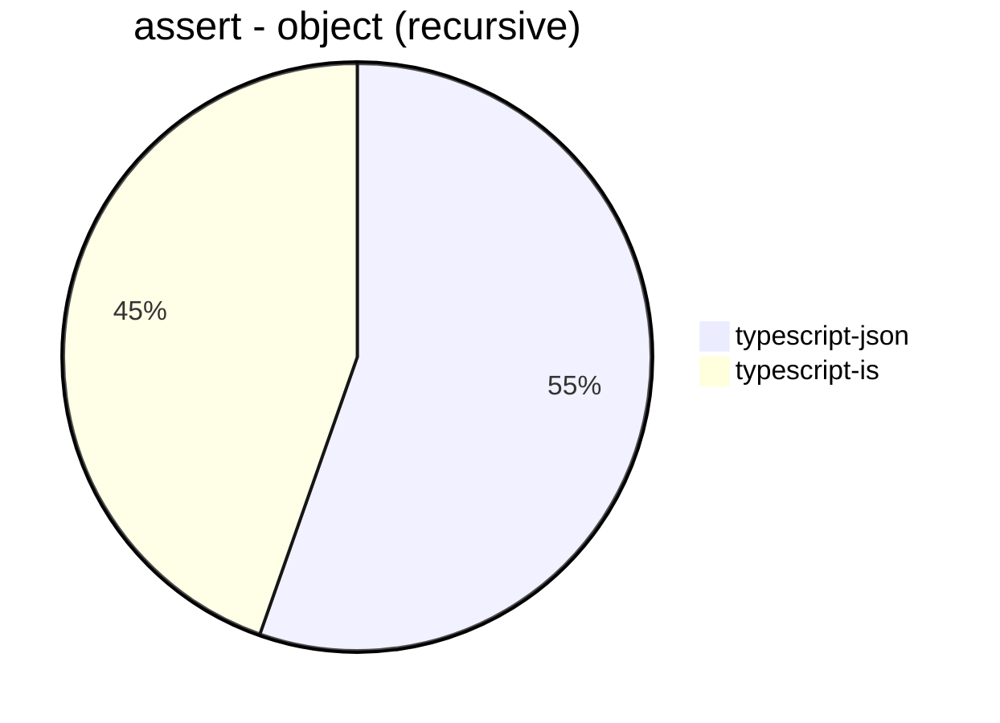
```mermaid
pie title assert - object (recursive)
  "typescript-json": 16419.82142857143
  "typescript-is": 13230.864855265494
```

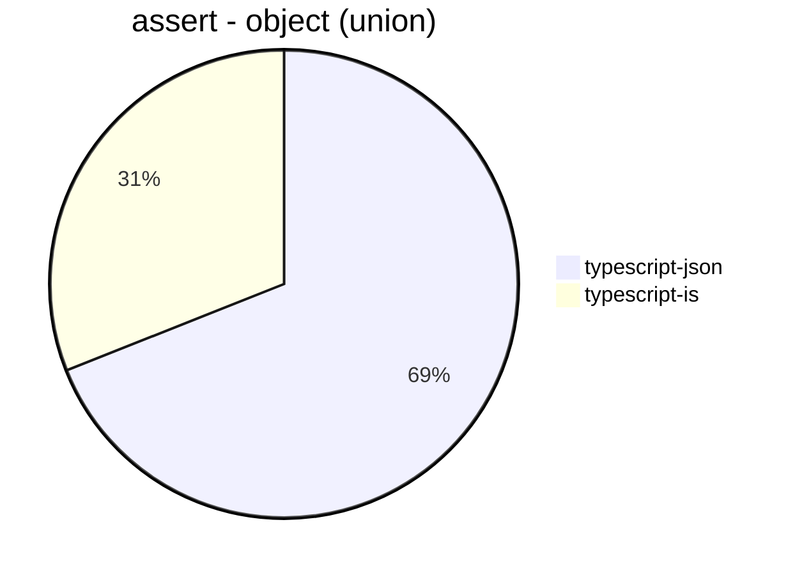
```mermaid
pie title assert - object (union)
  "typescript-json": 2885.8618233618236
  "typescript-is": 1297.593390804598
```

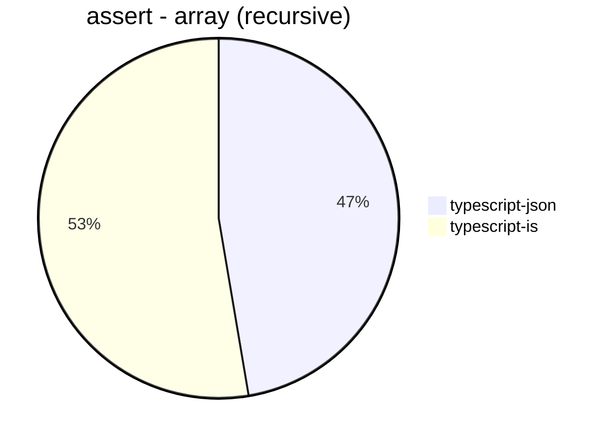
```mermaid
pie title assert - array (recursive)
  "typescript-json": 851.2149532710281
  "typescript-is": 946.944749359678
```

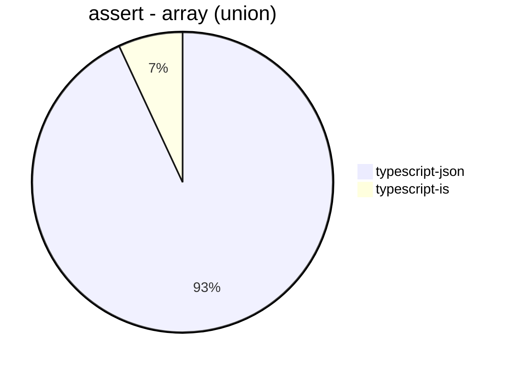
```mermaid
pie title assert - array (union)
  "typescript-json": 1817.8772919605078
  "typescript-is": 135.3758460990381
```

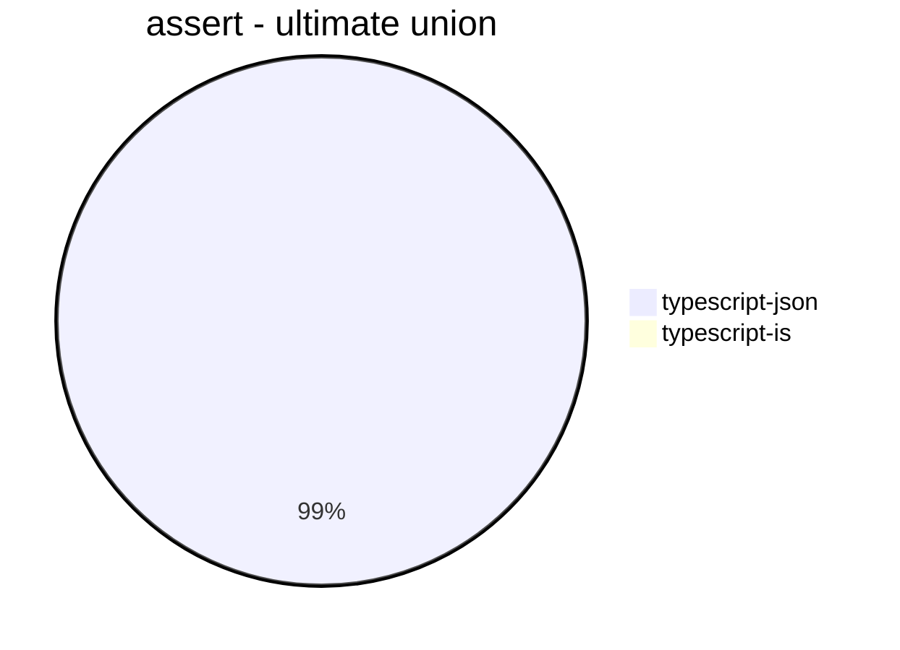
```mermaid
pie title assert - ultimate union
  "typescript-json": 2579.755736491488
  "typescript-is": 20.65884980457845
```

## is
 Components | typescript-json | typescript-is | ajv 
------------|-----------------|---------------|-----
object (hierarchical) | 52415.49671228008 | 26377.40600827487 | 41153.392330383474
object (recursive) | 35406.3233965673 | 22394.315524374888 | Failed
object (union, explicit) | 4123.747583055018 | Failed | 539.6568468760116
object (union, implicit) | 8046.666666666666 | Failed | Failed
array (recursive) | 3733.3951762523193 | 2495.980557113479 | Failed
array (union, explicit) | 3714.694315337862 | 568.6239830208702 | Failed
array (union, implicit) | 4000.5313496280555 | 594.4571127872304 | Failed
ultimate union | 5619.240692959823 | 171.21184757088676 | Failed

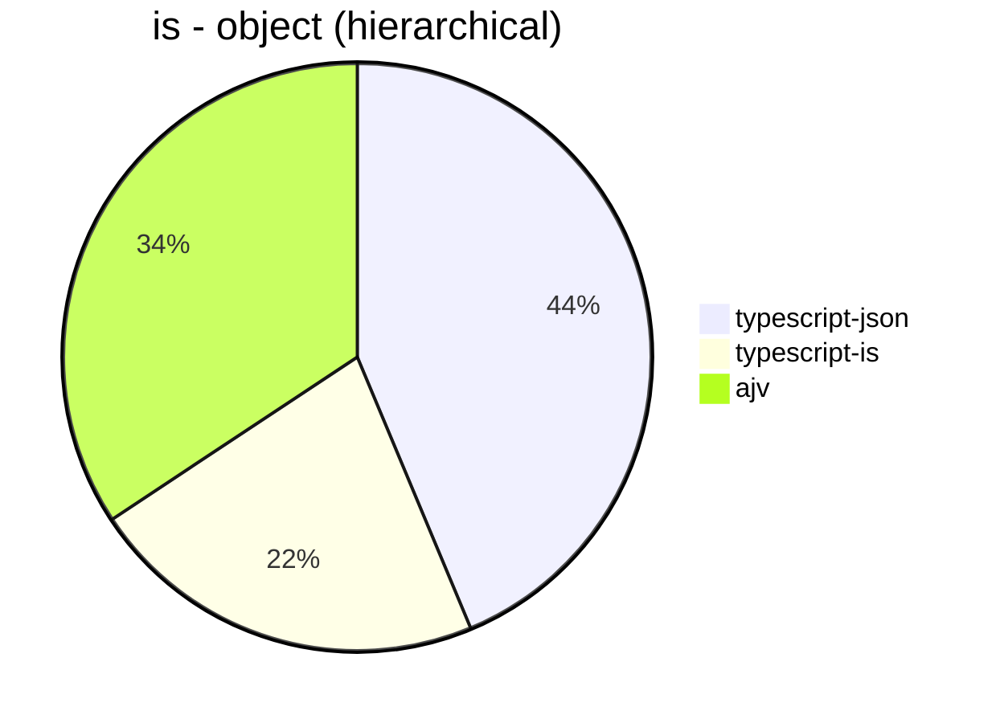
```mermaid
pie title is - object (hierarchical)
  "typescript-json": 52415.49671228008
  "typescript-is": 26377.40600827487
  "ajv": 41153.392330383474
```

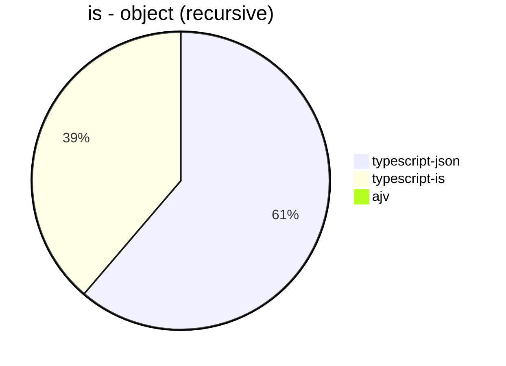
```mermaid
pie title is - object (recursive)
  "typescript-json": 35406.3233965673
  "typescript-is": 22394.315524374888
  "ajv": 0
```

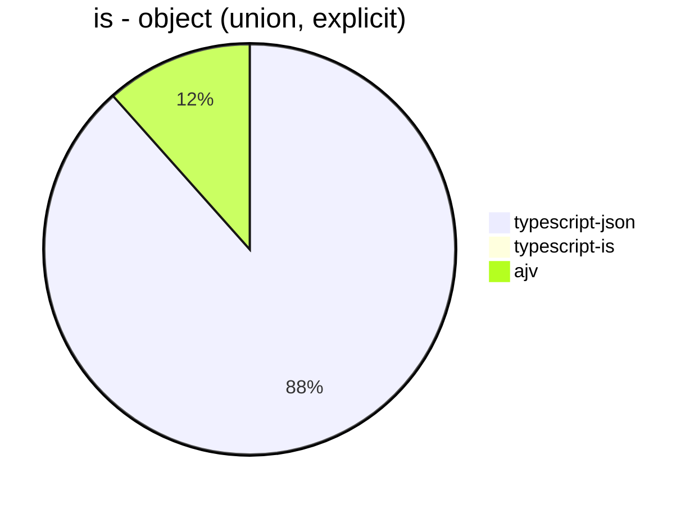
```mermaid
pie title is - object (union, explicit)
  "typescript-json": 4123.747583055018
  "typescript-is": 0
  "ajv": 539.6568468760116
```

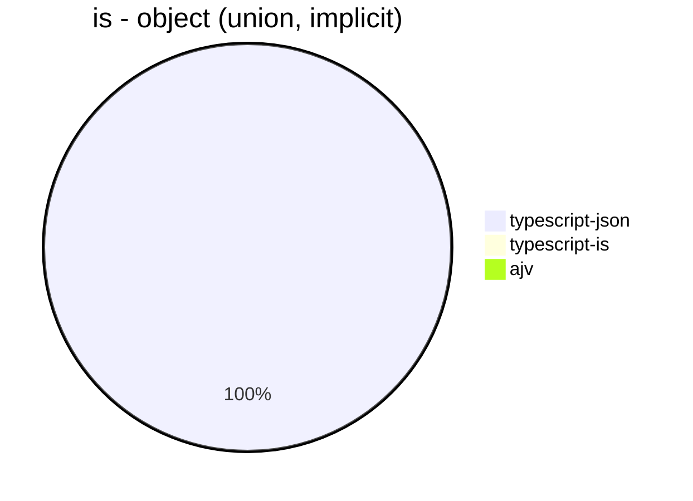
```mermaid
pie title is - object (union, implicit)
  "typescript-json": 8046.666666666666
  "typescript-is": 0
  "ajv": 0
```

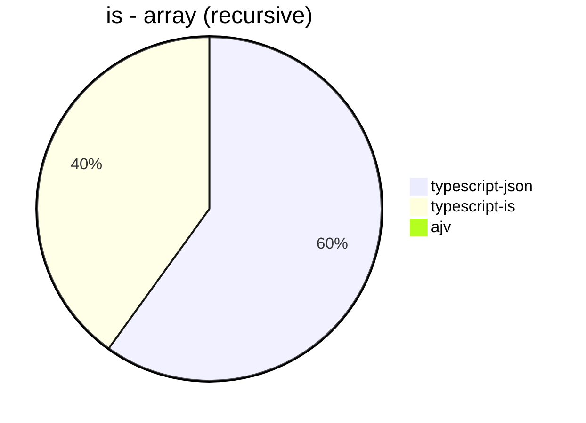
```mermaid
pie title is - array (recursive)
  "typescript-json": 3733.3951762523193
  "typescript-is": 2495.980557113479
  "ajv": 0
```

```mermaid
pie title is - array (union, explicit)
  "typescript-json": 3714.694315337862
  "typescript-is": 568.6239830208702
  "ajv": 0
```

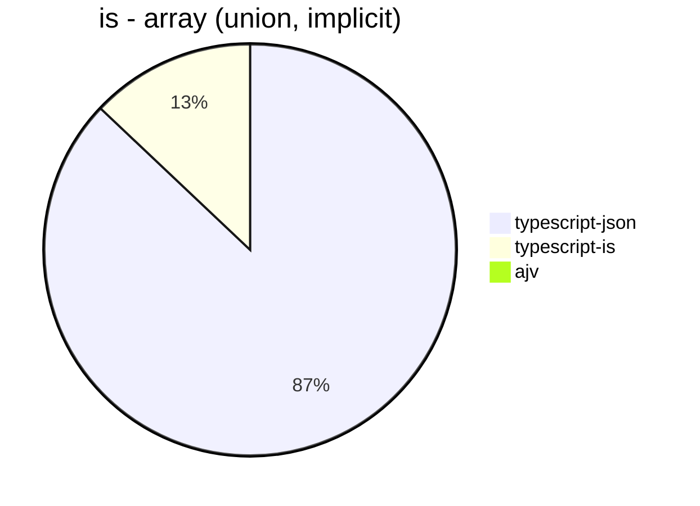
```mermaid
pie title is - array (union, implicit)
  "typescript-json": 4000.5313496280555
  "typescript-is": 594.4571127872304
  "ajv": 0
```

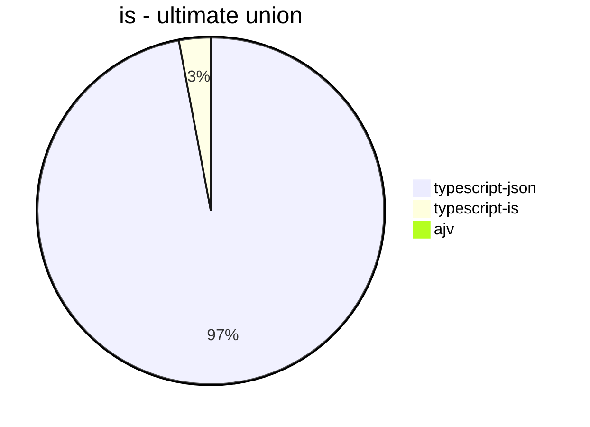
```mermaid
pie title is - ultimate union
  "typescript-json": 5619.240692959823
  "typescript-is": 171.21184757088676
  "ajv": 0
```

## optimizer
 Components | typescript-json | fast-json-stringify | JSON.stringify() 
------------|-----------------|---------------------|------------------
object (simple) | 22135.09675128706 | 3.499079189686925 | 6302.695619618121
object (hierarchical) | 2550.1182463161726 | 0.8824567596187787 | 1557.9005322077446
object (recursive) | 2949.3019838354153 | 32.378116858950506 | 1237.6698306346548
object (union) | 1183.6661911554922 | 0.7077140835102619 | 853.5268937278987
array (hierarchical) | 50.4402054292003 | 1.4812071838548417 | 39.04515173945226
array (recursive) | 142.96323802450797 | 26.02764315203734 | 121.54900870854178
array (union) | 223.32910704582503 | 1.2970168612191957 | 228.65116279069767
ultimate union | 743.5989902632527 | Failed | 177.04495210022108

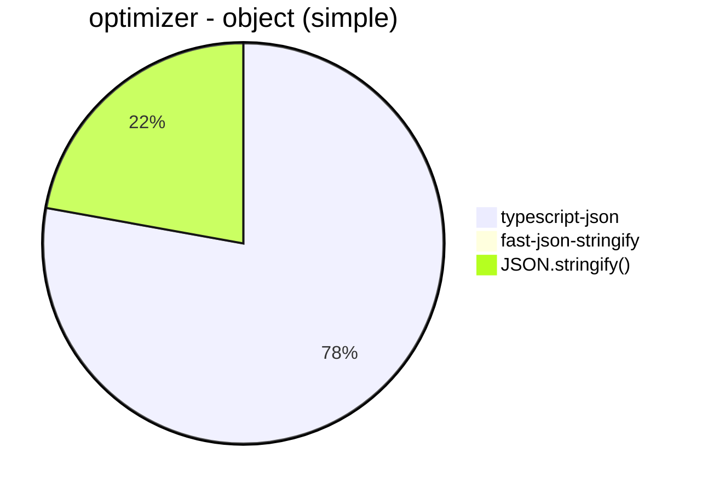
```mermaid
pie title optimizer - object (simple)
  "typescript-json": 22135.09675128706
  "fast-json-stringify": 3.499079189686925
  "JSON.stringify()": 6302.695619618121
```

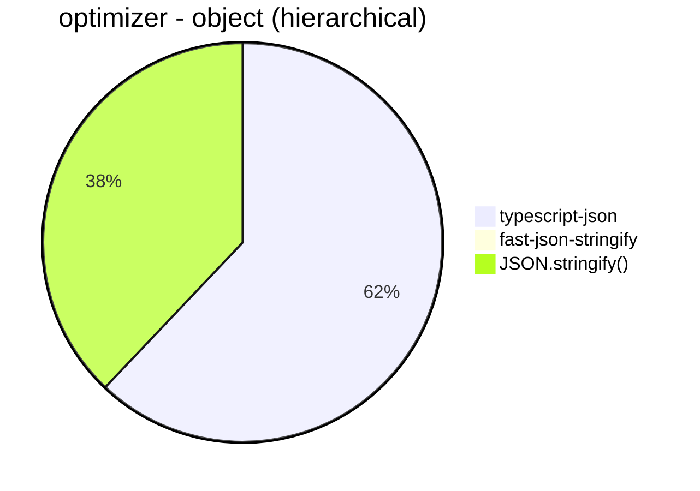
```mermaid
pie title optimizer - object (hierarchical)
  "typescript-json": 2550.1182463161726
  "fast-json-stringify": 0.8824567596187787
  "JSON.stringify()": 1557.9005322077446
```

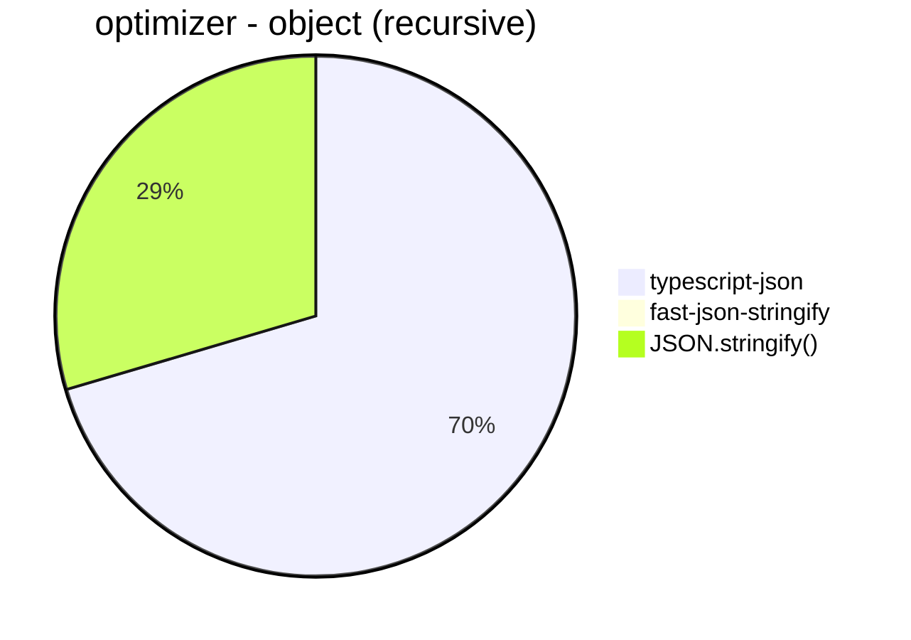
```mermaid
pie title optimizer - object (recursive)
  "typescript-json": 2949.3019838354153
  "fast-json-stringify": 32.378116858950506
  "JSON.stringify()": 1237.6698306346548
```

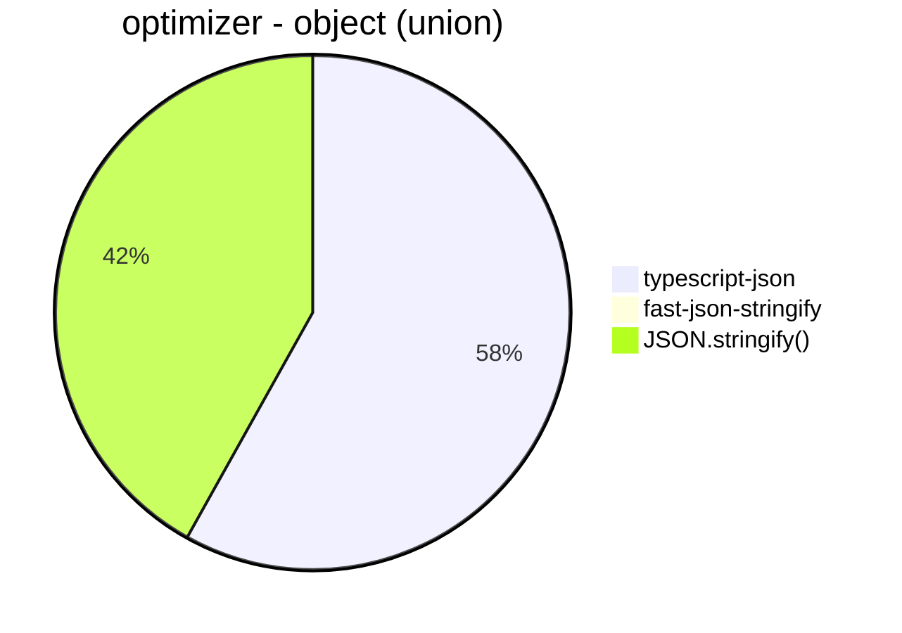
```mermaid
pie title optimizer - object (union)
  "typescript-json": 1183.6661911554922
  "fast-json-stringify": 0.7077140835102619
  "JSON.stringify()": 853.5268937278987
```

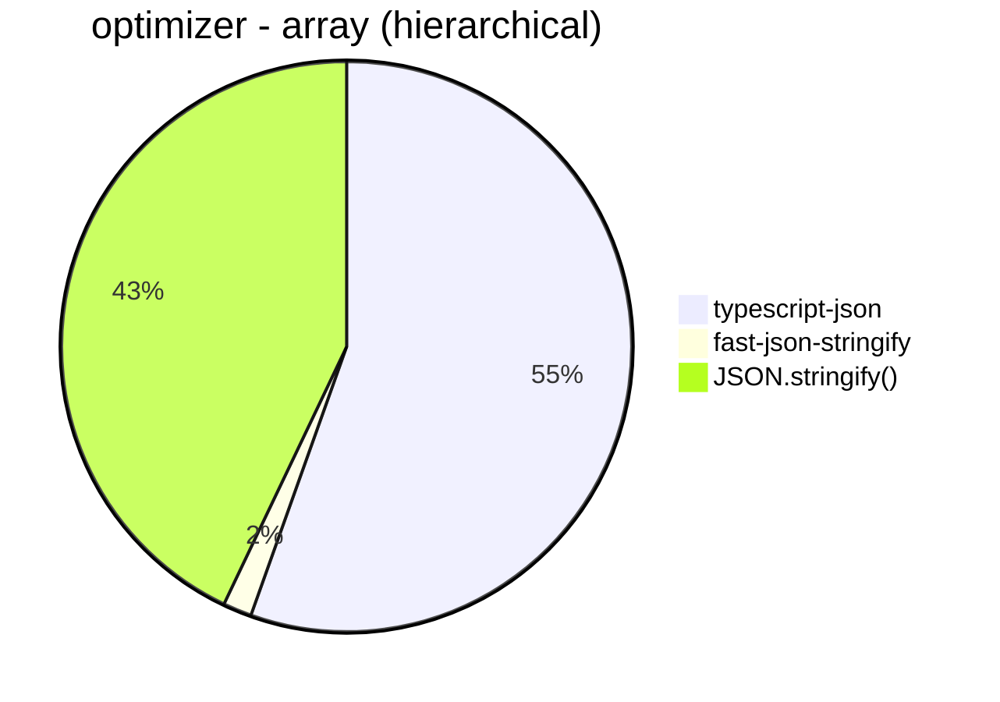
```mermaid
pie title optimizer - array (hierarchical)
  "typescript-json": 50.4402054292003
  "fast-json-stringify": 1.4812071838548417
  "JSON.stringify()": 39.04515173945226
```

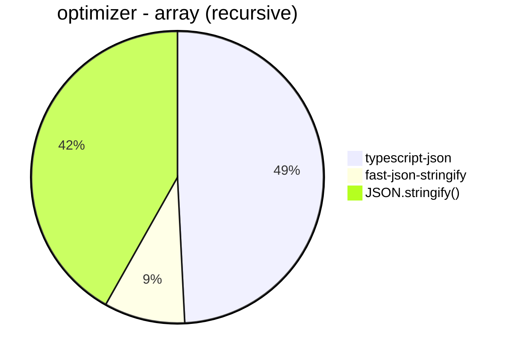
```mermaid
pie title optimizer - array (recursive)
  "typescript-json": 142.96323802450797
  "fast-json-stringify": 26.02764315203734
  "JSON.stringify()": 121.54900870854178
```

```mermaid
pie title optimizer - array (union)
  "typescript-json": 223.32910704582503
  "fast-json-stringify": 1.2970168612191957
  "JSON.stringify()": 228.65116279069767
```

```mermaid
pie title optimizer - ultimate union
  "typescript-json": 743.5989902632527
  "fast-json-stringify": 0
  "JSON.stringify()": 177.04495210022108
```

## stringify
 Components | typescript-json | fast-json-stringify | JSON.stringify() 
------------|-----------------|---------------------|------------------
object (simple) | 20807.00487452609 | 16743.760100556654 | 6116.219198234646
object (hierarchical) | 3109.1407678244973 | 3061.7394416607017 | 1608.6219879518071
object (recursive) | 2992.41723691511 | 1191.1658218682114 | 1251.0863404496504
object (union) | 1220.0878155872667 | 914.0899833364192 | 801.9749603244577
array (hierarchical) | 59.300648882480175 | 86.70733961915326 | 44.9945789663896
array (recursive) | 145.30551415797316 | 123.31838565022422 | 118.66546438232642
array (union) | 222.16340215281454 | 202.2389429253074 | 223.06442880346506
ultimate union | 761.4763128901947 | Failed | 172.17360242900517

```mermaid
pie title stringify - object (simple)
  "typescript-json": 20807.00487452609
  "fast-json-stringify": 16743.760100556654
  "JSON.stringify()": 6116.219198234646
```

```mermaid
pie title stringify - object (hierarchical)
  "typescript-json": 3109.1407678244973
  "fast-json-stringify": 3061.7394416607017
  "JSON.stringify()": 1608.6219879518071
```

```mermaid
pie title stringify - object (recursive)
  "typescript-json": 2992.41723691511
  "fast-json-stringify": 1191.1658218682114
  "JSON.stringify()": 1251.0863404496504
```

```mermaid
pie title stringify - object (union)
  "typescript-json": 1220.0878155872667
  "fast-json-stringify": 914.0899833364192
  "JSON.stringify()": 801.9749603244577
```

```mermaid
pie title stringify - array (hierarchical)
  "typescript-json": 59.300648882480175
  "fast-json-stringify": 86.70733961915326
  "JSON.stringify()": 44.9945789663896
```

```mermaid
pie title stringify - array (recursive)
  "typescript-json": 145.30551415797316
  "fast-json-stringify": 123.31838565022422
  "JSON.stringify()": 118.66546438232642
```

```mermaid
pie title stringify - array (union)
  "typescript-json": 222.16340215281454
  "fast-json-stringify": 202.2389429253074
  "JSON.stringify()": 223.06442880346506
```

```mermaid
pie title stringify - ultimate union
  "typescript-json": 761.4763128901947
  "fast-json-stringify": 0
  "JSON.stringify()": 172.17360242900517
```

